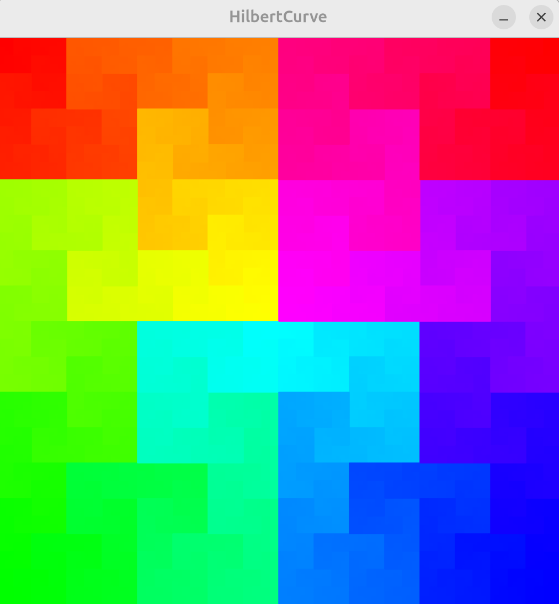

The Hilbert curve is a space filling fractal, meaning it's a continuous line that twists and turns in such a way that it passes through every point in a square area. The more mathematically accurate definition of the Hilbert curve requires an infinite number of iterations so this implementation is more accurately called a pseudo Hilbert curve, which approximates the true curve at a finite level of detail.

[3Blue1Brown's video](https://www.youtube.com/watch?v=3s7h2MHQtxc) has a very interesting and visually intuitive explanation of the Hilbert curve.

Here's a preview at different levels of iteration:

**Iteration level: 6**
<video src="https://github.com/user-attachments/assets/95733b80-d676-4392-b070-41be7de798a6"></video>

**Iteration level: 10**

  

