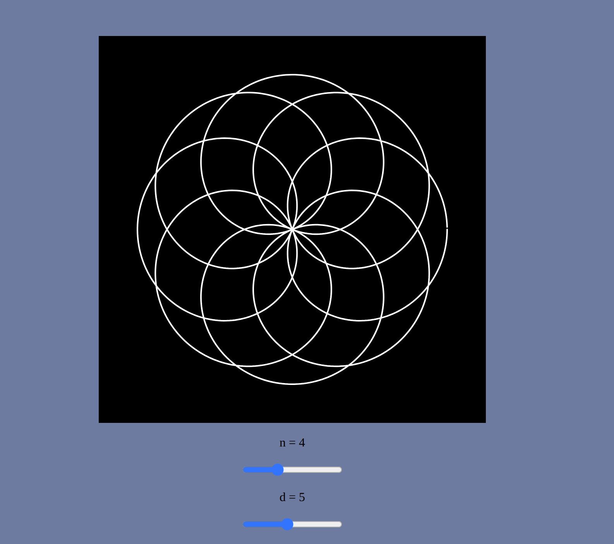
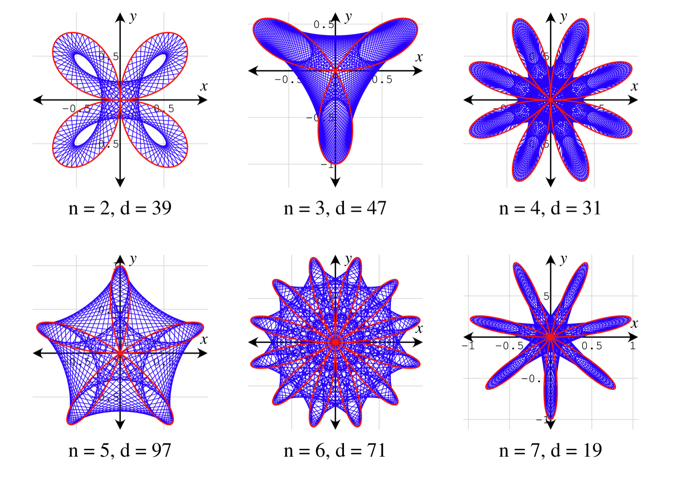
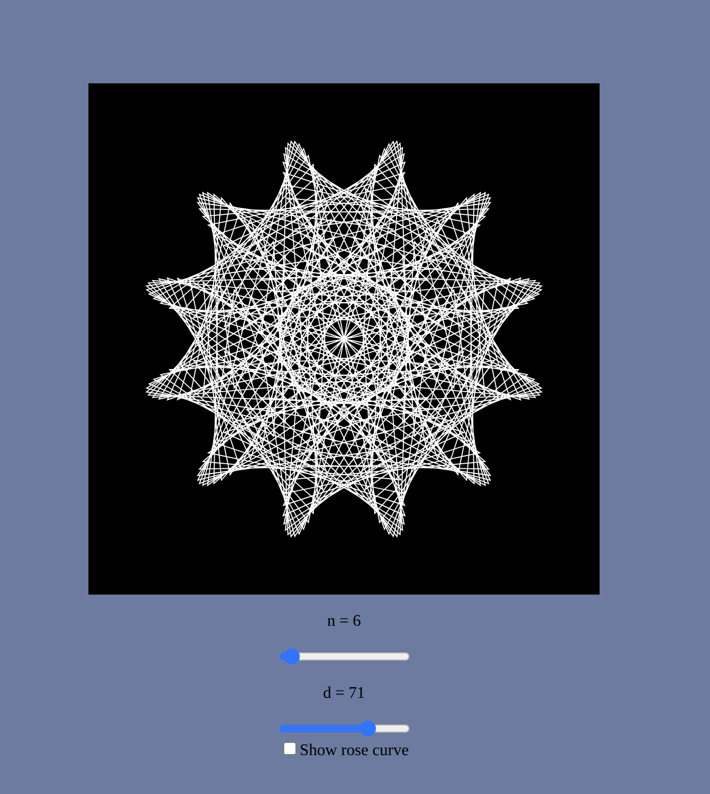

### Rose Curve
A rose curve is a type of mathematical curve that resembles the shape of a flower with petals. It is a sinusoid specified by either the cosine or sine functions with no phase angle that is plotted in polar coordinates.
A rose is the set of points in polar coordinates defined by the polar equation:

$$
r = a \cos(k\theta)
$$

Alternatively, in Cartesian coordinates, this can be expressed using the parametric equations:

$$
\begin{aligned}
x &= r \cos(\theta) = a \cos(k\theta) \cos(\theta) \\
y &= r \sin(\theta) = a \cos(k\theta) \sin(\theta)
\end{aligned}
$$

Where:
- a controls the size of the petals,
- k affects the number of petals and is in irreducible form $k = ⁠n/d$,
- $\theta$ is the angle in radians.

The different types of flowers according to the values of n and d can be seen in this picture:

  

When k is a non-zero integer, the curve will be rose-shaped with 2k petals if k is even, and k petals when k is odd.

### The program
The user can change the values of n and d through two sliders to recreate the roses of the photograph.

A preview of the program can be seen here:

  

### Maurer Rose
A Maurer rose of the rose $r = sin(nθ)$ consists of the 360 lines successively connecting the above 361 points. Thus a Maurer rose is a polygonal curve with vertices on a rose.

Let $r = sin(nθ)$ be a rose in the polar coordinate system, where here we consider n a positive integer. So and mentioned above the rose has n petals if n is odd, and 2n petals if n is even.

We then take 361 points on the rose:

$$
\begin{aligned}
(sin(nk), k) (k = 0, d, 2d, 3d, ..., 360d),
\end{aligned}
$$

where d is a positive integer and the angles are in **degrees**, not radians.

#### In Simple Words
The Maurer rose uses the same points as the rose curve, but instead of drawing a smooth curve through them, it draws straight lines between them in a specific sequence.
You can think of it like tracing the rose shape with a string, connecting dots along the edge.

Here are some Maurer rose shapes:

### The program
Again the user can change the values of n and d through two sliders to create all kinds of pretty and majestic maurer roses, and can also check a box to choose whether to show the underlying basic rose curve.

Here's a preview:

  

