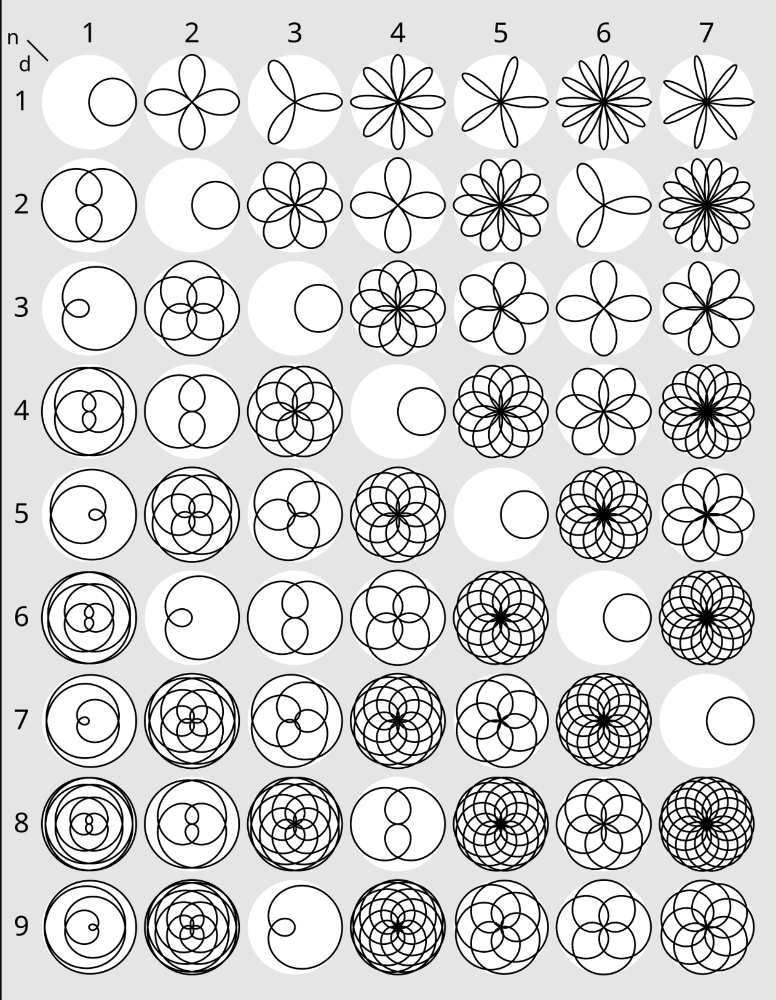

A rose curve is a type of mathematical curve that resembles the shape of a flower with petals. It is a sinusoid specified by either the cosine or sine functions with no phase angle that is plotted in polar coordinates.
A **rose** is the set of points in polar coordinates defined by the polar equation:

$$
r = a \cos(k\theta)
$$

Alternatively, in Cartesian coordinates, this can be expressed using the parametric equations:

$$
\begin{aligned}
x &= r \cos(\theta) = a \cos(k\theta) \cos(\theta) \\
y &= r \sin(\theta) = a \cos(k\theta) \sin(\theta)
\end{aligned}
$$

Where:
- a controls the size of the petals,
- k affects the number of petals and is in irreducible form $k = ⁠n/d$,
- $\theta$ is the angle in radians.

The different types of flowers according to the values of n and d can be seen in this picture:

  

